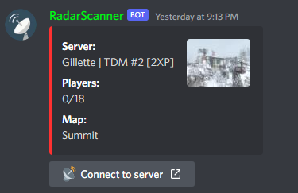

   
  

    
  

### Version 1.0.0

_______

### About

**RadarScanner** is my own verson of [Sparker-99 Admin-bot](https://github.com/Sparker-99/Admin-bot). For example this version has new updated embeds using discord buttons to easily connect to the specific server you search. More updates are comming soon and more features will be enabled once everything is stable.

___

### Screenshots

   
  

    
    
  

___

### Download

Please downlod the latest versions of:

* [RadarScanner](https://slxxpy.xyz/) *any version you wish to use*
* [Node.js](https://nodejs.org/en/) *version* 16 *or newer*
* [IW4M Admin](https://raidmax.org/IW4MAdmin) *version* 2022.02.02.2 *or newer*
___

### Installation

* Windows
  + Install Node.js
  + Extract `RadarScanner.zip`
  + Edit `config.json` (add your token, prefix, webfronturl and adminid)
  + Open console inside the **RadarScanner's** directory, type `npm i` and hit enter
  + Run `StartRadarScanner.cmd` or `node .` in command prompt
___

### Updating to new version

Download [latest release](https://slxxpy.xyz/) and Extract into old version directory.
+ Existing `config.json` and `database` folder will be not overwritten by the update.
+ NOTE: any changes you've made in the discord files will be overwritten!.
+ Please backup or rename the file before updating.
___

### Configuration

#### Initial Configuration

Create a discord application from [discord developers](https://discord.com/developers/applications), click on add bot and copy the token if you dont know how read this [Wiki](https://github.com/Sparker-99/Admin-bot/wiki/Creating-and-adding-a-bot)

* `token` &mdash; Insert the bot token
* `prefix` &mdash; Insert the bot prefix that is used before commands like !help
* `webfronturl` &mdash; Insert the IW4M Admin webfront url. In case of local refrain from using 127.0.0.1 or such use IPv4 or DHCP address.
  + Example: https://nbsclan.org, http://192.168.1.2
* `results_perpage` &mdash; Insert a number from **1** upto **10** to set number of results per page of status and players command

 #### Optional Configuration

* `custom_presence` &mdash; You can set bot's custom presence. Use this following parameters below
  + `{m}` &mdash; max players count
  + `{p}` &mdash; players online count
  + `{s}` &mdash; total server count
 * `status_channel_id` &mdash; You can insert a discord channel's id to send autostatus on an interval
 * `statchan_update_interval` &mdash; Specifies how often the bot will update the autostatus in channel in seconds
 * `color` &mdash; You can insert a hex colour code to get that colour for all embed discord messages
 * `thumbnail_image_url` &mdash; You can insert an image link to get custom thumbnail for all embed discord messages
 * `footer` &mdash; You can insert a footer message to display as footer for all embed discord messages
 * `ownerid` &mdash; You can insert an admin's or bot owner's client id to lock botinfo for administrator or bot owner
 ___

### FAQ

* #### Does Admin bot stores my ID and Password for Webfront ?

  + **No**, Admin bot retrieves **cookies** 🍪 from webfront which is saved and used for executing commands from Discord. Cookies are valid for 30 days or until host machine restart. You can successfully delete id and password in dm after login success message.

* #### Why does the connect in serverinfo command not working ?

  + Not all clients support **direct connect**. Even it supports I dont know its launch url. If you know the launch url for **direct connect** for any client contact me on [Discord](https://discord.gg/tGkbpCD)

* #### Why not use a proper Sqlite database instead of Json database ?

  + Sqlite Requires [Node-Gyp](https://github.com/nodejs/node-gyp) which is a hassle for most windows users. So for Advanced Users [Admin bot with Sqlite](https://github.com/Sparker-99/Admin-bot/tree/sqlite3) is available. There is no need for this tool in case of linux.
___

### Contributers

* [Sparker](https://github.com/Sparker-99)
* [Martian](https://github.com/saiteja-madha)
* [Zwambro](https://github.com/Zwambro)
* [Pickle Rick](https://github.com/LelieL91)
* [Insanemode](https://github.com/INSANEMODE)